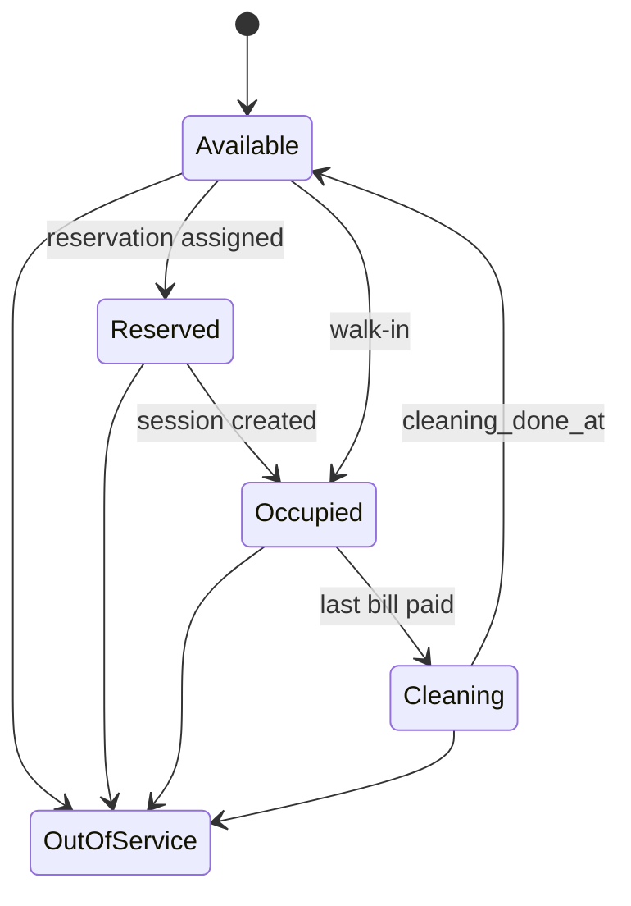
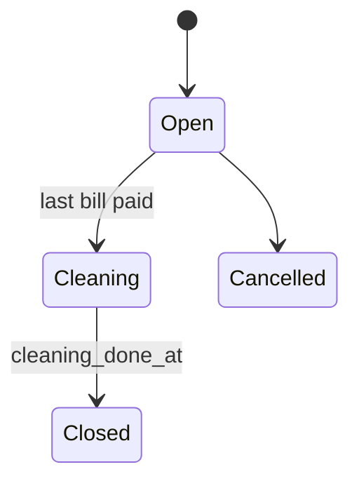
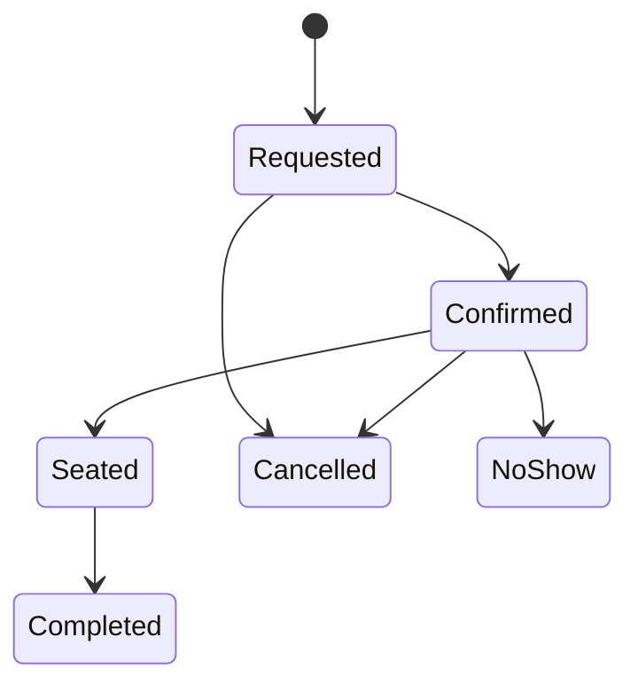
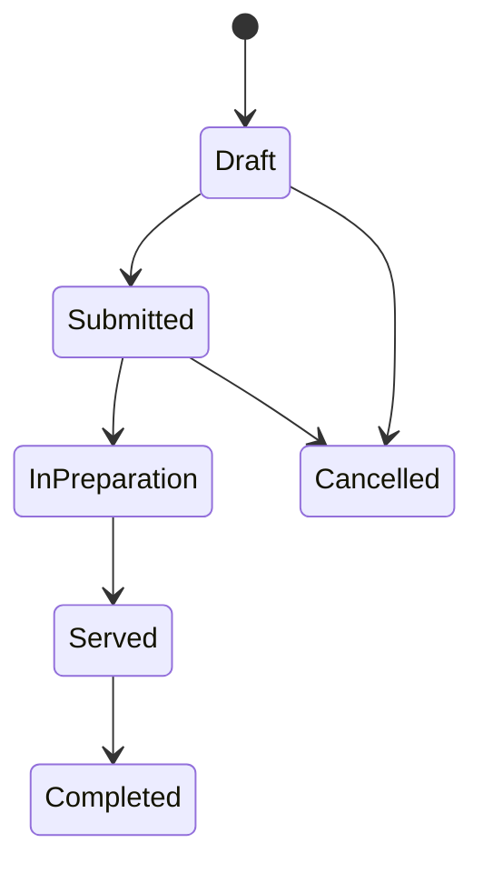
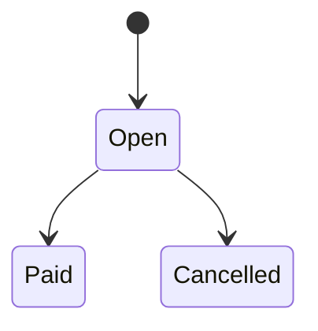
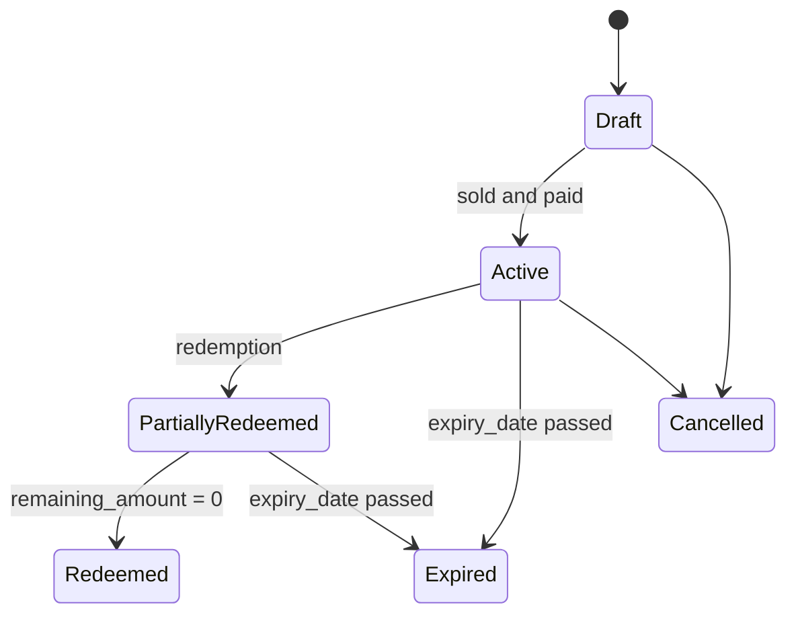
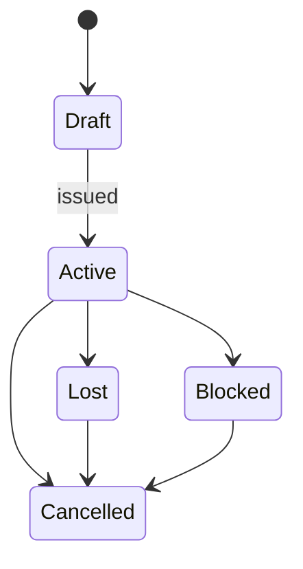
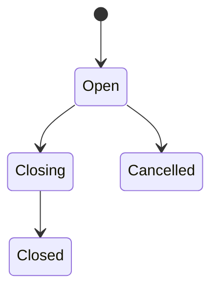
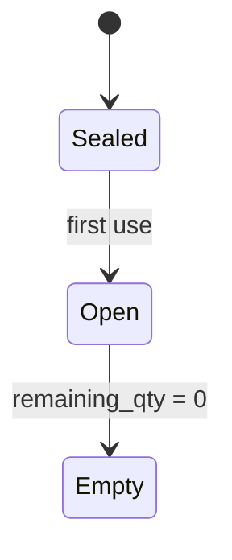

# ERPNext Restaurant - Design Notes

This document keeps the living design notes for the app. It will be updated as the data model, architecture, and flows evolve.

## Current Status
- Data model scaffolding: core DocTypes for areas, tables, floor plans, shifts, reservations, sessions, orders, bills, discounts, vouchers, loyalty cards, menu items, modifiers, combos, settings, POS profiles, item classes, recipes, and ingredient containers.
- Split billing is modeled via Restaurant Bill + Bill Items.
- No UI, flows, or kitchen display logic implemented yet.

## DocType Overview (Quick Reference)
Use this section as a compact checklist of all DocTypes and their purpose.

Core DocTypes:
- Restaurant Area: venue sections for reporting and table grouping.
- Restaurant Table: physical tables with status, capacity, and area link.
- Restaurant Floor Plan: layout container for tables (per area).
- Restaurant Shift: global service session for staff and cash tracking.
- Restaurant Reservation: time-based booking with assigned tables.
- Restaurant Table Session: active guest session per table (Dine-In, Takeaway, Delivery, Bar-Only).
- Restaurant Order: staff order document per entry session.
- Restaurant Bill: bill record for a session or quick-pay.
- Restaurant Discount: percent-only discount definitions.
- Restaurant Voucher: stored-value vouchers with balance and expiry.
- Restaurant Loyalty Card: QR-based loyalty account with optional contact info.
- Restaurant Menu Item: POS configuration wrapper for ERPNext Item.
- Restaurant Modifier Group: reusable modifier sets with selection rules.
- Restaurant Combo: bundle definition with a single price.
- Restaurant Settings: global feature toggles and defaults.
- Restaurant POS Profile: per-user POS defaults.
- Restaurant Item Class: menu grouping and filtering (Food, Drinks, etc.).
- Restaurant Recipe: simple recipe for consumption tracking.
- Restaurant Ingredient Container: per-container stock tracking for liquids/units.

Child DocTypes:
- Restaurant Order Item: order line items (items, qty, rate, status).
- Restaurant Order Item Modifier: selected modifiers on an order line.
- Restaurant Order Item Combo Item: selected combo components on an order line.
- Restaurant Bill Item: bill line items (split billing support).
- Restaurant Bill Payment: payment lines with tips/vouchers/processed_by.
- Restaurant Recipe Ingredient: ingredients per recipe line.
- Restaurant Floor Plan Table: per-plan table coordinates.
- Restaurant Shift Assignment: staff in a shift (role/user).
- Restaurant Reservation Table: tables assigned to a reservation.
- Restaurant Voucher Redemption: voucher usage lines (partial redemption).
- Restaurant Loyalty Ledger: points movements per card.
- Restaurant Menu Item Modifier: modifier group assignments per menu item.
- Restaurant Modifier Option: options in a modifier group (price deltas only).
- Restaurant POS Profile User: users assigned to POS profile.
- Restaurant Ingredient Consumption: consumption rows created at payment.

## Data Model (MVP)

### Core DocTypes
- Restaurant Area: logical sections of the venue (e.g. Main, Patio).
- Restaurant Table: physical tables linked to an area with capacity and shape.
- Restaurant Floor Plan: layout container per area (default plan shown in POS).
- Restaurant Shift: global shift container for service and cash tracking.
- Restaurant Reservation: table reservation with assigned tables and time window.
- Restaurant Table Session: an open table or service context (Dine-In/Takeaway/Delivery/Bar-Only).
- Restaurant Order: orders attached to a session, with line items.
- Restaurant Bill: a bill per split group, with payments.
- Restaurant Discount: fixed percent-only discount definitions selectable at payment.
- Restaurant Voucher: stored-value voucher with balance and expiry.
- Restaurant Loyalty Card: QR-based loyalty account with optional contact info and balance.
- Restaurant Menu Item: menu config wrapper around ERPNext Item.
- Restaurant Modifier Group: reusable modifier group with selection rules and options.
- Restaurant Combo: bundle definitions with a single combo price.
- Restaurant Settings: global configuration (defaults, shift requirements).
- Restaurant POS Profile: user-specific POS defaults and assignment list.
- Restaurant Item Class: menu grouping (Food, Drinks, etc.).
- Restaurant Recipe: simple mix/recipe data for items (cocktails, prep).
- Restaurant Ingredient Container: per-bottle or per-pack stock unit with remaining qty and empty tracking.

### Child DocTypes
- Restaurant Order Item: lines on Restaurant Order, can record taken_by per item.
- Restaurant Bill Item: lines on Restaurant Bill.
- Restaurant Bill Payment: payments, tips, vouchers, and processed_by.
- Restaurant Recipe Ingredient: ingredients for a recipe.
- Restaurant Floor Plan Table: per-plan coordinates for tables.
- Restaurant Shift Assignment: staff participating in a shift.
- Restaurant Reservation Table: tables assigned to a reservation.
- Restaurant Voucher Redemption: voucher usage lines linked to bills.
- Restaurant Loyalty Ledger: points movements per card (earn, redeem, transfer).
- Restaurant Modifier Option: option lines for a modifier group (price delta only).
- Restaurant Menu Item Modifier: group assignments for a menu item.
- Restaurant Order Item Modifier: selected modifiers on an order line.
- Restaurant Combo Component: included item rules for a combo.
- Restaurant Order Item Combo Item: selected combo items on an order line.
- Restaurant POS Profile User: users assigned to a POS profile.
- Restaurant Ingredient Consumption: ingredient usage recorded at billing.

### External ERPNext DocTypes Used
- Item, Customer, Address, Employee, User, Mode of Payment, UOM, Warehouse, Batch, Stock Entry

## ER Diagram (MVP)

```mermaid
erDiagram
    RESTAURANT_AREA ||--o{ RESTAURANT_TABLE : contains
    RESTAURANT_AREA ||--o{ RESTAURANT_FLOOR_PLAN : has
    RESTAURANT_FLOOR_PLAN ||--o{ RESTAURANT_FLOOR_PLAN_TABLE : arranges
    RESTAURANT_TABLE ||--o{ RESTAURANT_FLOOR_PLAN_TABLE : placed_as
    RESTAURANT_SHIFT ||--o{ RESTAURANT_SHIFT_ASSIGNMENT : assigns
    RESTAURANT_SHIFT ||--o{ RESTAURANT_TABLE_SESSION : groups
    RESTAURANT_SHIFT ||--o{ RESTAURANT_ORDER : groups
    RESTAURANT_POS_PROFILE ||--o{ RESTAURANT_POS_PROFILE_USER : assigns
    USER ||--o{ RESTAURANT_POS_PROFILE_USER : uses
    USER ||--o{ RESTAURANT_ORDER_ITEM : taken_by
    RESTAURANT_SHIFT ||--o{ RESTAURANT_BILL : groups
    RESTAURANT_DISCOUNT ||--o{ RESTAURANT_BILL : applied_to
    RESTAURANT_VOUCHER ||--o{ RESTAURANT_BILL_PAYMENT : applied_to
    RESTAURANT_VOUCHER ||--o{ RESTAURANT_VOUCHER_REDEMPTION : redeems
    RESTAURANT_BILL ||--o{ RESTAURANT_VOUCHER_REDEMPTION : records
    RESTAURANT_LOYALTY_CARD ||--o{ RESTAURANT_LOYALTY_LEDGER : logs
    RESTAURANT_BILL ||--o{ RESTAURANT_LOYALTY_LEDGER : earns
    USER ||--o{ RESTAURANT_LOYALTY_LEDGER : processed_by
    ITEM ||--o{ RESTAURANT_MENU_ITEM : menu_item
    RESTAURANT_MENU_ITEM ||--o{ RESTAURANT_MENU_ITEM_MODIFIER : configures
    RESTAURANT_MODIFIER_GROUP ||--o{ RESTAURANT_MENU_ITEM_MODIFIER : assigned
    RESTAURANT_MODIFIER_GROUP ||--o{ RESTAURANT_MODIFIER_OPTION : offers
    RESTAURANT_ORDER_ITEM ||--o{ RESTAURANT_ORDER_ITEM_MODIFIER : customizes
    RESTAURANT_MODIFIER_GROUP ||--o{ RESTAURANT_ORDER_ITEM_MODIFIER : selected_from
    RESTAURANT_COMBO ||--o{ RESTAURANT_COMBO_COMPONENT : includes
    RESTAURANT_COMBO ||--o{ RESTAURANT_ORDER_ITEM : sold_as
    RESTAURANT_ORDER_ITEM ||--o{ RESTAURANT_ORDER_ITEM_COMBO_ITEM : bundles
    RESTAURANT_RESERVATION ||--o{ RESTAURANT_RESERVATION_TABLE : reserves
    RESTAURANT_TABLE ||--o{ RESTAURANT_RESERVATION_TABLE : reserved_as
    RESTAURANT_RESERVATION ||--o{ RESTAURANT_TABLE_SESSION : seats_as
    RESTAURANT_TABLE ||--o{ RESTAURANT_TABLE_SESSION : opens
    RESTAURANT_TABLE_SESSION ||--o{ RESTAURANT_ORDER : has
    RESTAURANT_ORDER ||--o{ RESTAURANT_ORDER_ITEM : includes
    RESTAURANT_TABLE_SESSION ||--o{ RESTAURANT_BILL : billed
    RESTAURANT_BILL ||--o{ RESTAURANT_BILL_ITEM : includes
    RESTAURANT_BILL_ITEM ||--o{ RESTAURANT_INGREDIENT_CONSUMPTION : consumes
    RESTAURANT_INGREDIENT_CONTAINER ||--o{ RESTAURANT_INGREDIENT_CONSUMPTION : used_from
    RESTAURANT_SHIFT ||--o{ RESTAURANT_INGREDIENT_CONTAINER : empties
    RESTAURANT_BILL ||--o{ RESTAURANT_BILL_PAYMENT : paid_with
    USER ||--o{ RESTAURANT_BILL_PAYMENT : processed_by
    RESTAURANT_ITEM_CLASS ||--o{ RESTAURANT_ORDER_ITEM : classifies
    RESTAURANT_RECIPE ||--o{ RESTAURANT_RECIPE_INGREDIENT : composed_of
    RESTAURANT_RECIPE ||--o{ RESTAURANT_INGREDIENT_CONSUMPTION : computed_from
    ITEM ||--o{ RESTAURANT_ORDER_ITEM : ordered_item
    ITEM ||--o{ RESTAURANT_RECIPE : recipe_for
    CUSTOMER ||--o{ RESTAURANT_TABLE_SESSION : optional
    CUSTOMER ||--o{ RESTAURANT_BILL : optional
```


## Notes
- Order Type values are fixed for now: Dine-In, Takeaway, Delivery, Bar-Only.
- Split billing uses multiple Restaurant Bill records per table session. Each bill can select a subset of order items.
- Recipes are intentionally simple (ratio + qty) to support custom mixes without full BOM complexity.
- Table layout coordinates live in Restaurant Floor Plan Table, not in Restaurant Table.
- POS should load the default floor plan per area for staff usage.
- Shift is global; sessions, orders, and bills link back to the active shift.
- Table status includes Cleaning; sessions move Open -> Cleaning -> Closed.
- Session timestamps track first order, last payment, and cleaning start; cleaning_done_at marks table free.
- Reservations can be linked to a table session when the party is seated.
- Ingredient consumption is recorded at billing to allow cancellations before prep.
- Bill paid_at captures final payment time for split bills.
- Discounts are defined in Restaurant Discount and selected on the bill (percent-only).
- Vouchers support variable amounts, partial redemption, and expiry (default expiry set in Restaurant Settings).
- Restaurant Settings define feature toggles and defaults; POS Profiles provide per-user defaults.
- Empty containers are posted to ERPNext stock at shift close (per container).
- Loyalty cards store optional name/email and track points via ledger entries.
- Menu items can attach modifier groups; modifiers are price deltas only.
- Combos bundle items at a single price and capture chosen items per order line.

## Menu and Modifiers (MVP)
1) Create Restaurant Modifier Group with one or more Restaurant Modifier Options.
2) Each option uses price_delta (no absolute prices).
3) Assign groups to a Restaurant Menu Item (per ERPNext Item).
4) On ordering, selected modifiers are captured on Restaurant Order Item Modifier.
5) Optional: modifier options can link to an Item/Recipe for consumption tracking.

## Combos (MVP)
Combos are bundles like "Pizza + Drink" with a single combo price.

1) Create a Restaurant Combo and link it to a combo ERPNext Item.
2) Set combo_price (overrides the item rate in POS).
3) Add Restaurant Combo Component rows:
   - Use item_class to allow choice from a category (e.g. any Pizza).
   - Use item to force a specific selection (e.g. only Coca-Cola).
4) On ordering, select a combo and capture chosen items under Restaurant Order Item Combo Item.

### Example: Pizza + Drink Combo
- Combo: "Pizza + Drink Deal"
- Combo Item: "Combo Pizza + Drink" (ERPNext Item)
- Combo Price: 12.00
- Components:
  - Component Label: "Pizza", item_class = "Food", selection_type = Single
  - Component Label: "Drink", item_class = "Drinks", selection_type = Single

Order result:
- Order Item: Combo Pizza + Drink, rate = 12.00
- Order Item Combo Items:
  - Pizza Margherita (component_label = Pizza)
  - Cola 0.3l (component_label = Drink)

## Item/Recipe/Modifier Concepts (Detailed)
This section explains how Item Class, Menu Item, Order Item, and Modifiers fit together.

### Core Concepts
- Item Class: category/tagging only (Food, Drinks, Cocktails). Used for filtering and reporting.
- ERPNext Item: the real sellable product (e.g. Pizza Margherita, Vodka 0.2l).
- Menu Item: POS-facing configuration wrapper around ERPNext Item (active/inactive, allow_modifiers, default_recipe).
- Combo: bundle definition with a single combo price and component selection rules.
- Recipe: optional simple BOM-like definition for consumption (ingredients + qty).
- Order Item: actual sold line in an order, linked to the ERPNext Item.
- Order Item Modifier: chosen extras or options with price_delta only.
 - Order Item Combo Item: selected items that fulfill combo components.

### Order -> Bill -> Consumption Flow
Order items are the source of truth for what was sold. Billing can be split and consumption is posted on payment.

```mermaid
flowchart LR
    O[Restaurant Order] --> OI[Order Item]
    OI --> OIM[Order Item Modifier]
    OI --> OC[Order Item Combo Item]
    OI --> B[Restaurant Bill Item]
    OIM --> B
    OC --> B
    B --> C[Ingredient Consumption]
    C --> IC[Ingredient Container (optional)]
```

### Example 1: Pizza with Toppings (Price Deltas)
- ERPNext Item: "Pizza Margherita"
- Item Class: "Food"
- Menu Item: allow_modifiers = 1
- Modifier Group: "Toppings" (Multiple, max_select = 3)
- Modifier Options:
  - "Extra Cheese" price_delta = 2.00
  - "Olives" price_delta = 1.50

Order result:
- Order Item: Pizza Margherita, qty = 1, rate = 10.00
- Order Item Modifiers:
  - Extra Cheese, qty = 1, price_delta = 2.00
  - Olives, qty = 1, price_delta = 1.50

Bill total:
- 10.00 + 2.00 + 1.50 = 13.50

### Example 2: Cocktail with Recipe (Consumption)
- ERPNext Item: "Vodka Orange"
- Item Class: "Cocktails"
- Menu Item: default_recipe = "Vodka Orange Recipe"
- Recipe:
  - Vodka: 200 ml
  - Orange Juice: 300 ml

Order result:
- Order Item: Vodka Orange, qty = 1

Bill payment (consumption recorded on payment):
- Ingredient Consumption lines:
  - Vodka 200 ml
  - Orange Juice 300 ml

If container tracking is enabled:
- Consumption is drawn from open containers first.
- Example stock: 5 sealed 1000 ml bottles + 1 open bottle 100 ml.
- Consume 300 ml vodka:
  - open bottle 100 ml -> 0 (Empty)
  - next sealed bottle -> 900 ml remaining (Open)

### Example 3: Modifier-Recipe Combination
A modifier can optionally point to an Item or Recipe for extra consumption.
- Base Item: Burger (recipe uses 150 g meat)
- Modifier: "Extra Patty" price_delta = 3.00, recipe = "Patty 150 g"
On payment:
- Base recipe consumes 150 g meat
- Modifier recipe consumes an extra 150 g meat

## Process Overview (MVP)
1) Create a reservation if needed (time window + tables).
2) Seat the guest -> create a Table Session (optionally linked to Reservation).
3) Record the first order -> table/session becomes active.
4) Add additional orders and split bills as needed.
5) Last bill is paid -> set last_paid_at.
6) Move table to Cleaning -> set cleaning_started_at.
7) Cleaning done -> set cleaning_done_at, table becomes Available again.
8) Shift close -> empty containers are posted to ERPNext stock.

## Feature Toggles and POS Profiles
Feature toggles in Restaurant Settings:
- use_tables
- use_floor_plans
- use_reservations
- require_table_session
- enable_quick_pay
- enable_split_bills
- enable_discounts
- enable_vouchers
- enable_loyalty
- enable_tips

POS Profiles:
- Assign users to a POS profile for per-user defaults (area, floor plan, order type).
- Settings provide company-wide defaults; profiles override where specified.

## Voucher Flow (MVP)
1) Create a Restaurant Voucher with a variable initial_amount.
2) If expiry_date is empty, set it using Restaurant Settings voucher_default_expiry_days.
3) Sell the voucher on a bill (sold_bill) or activate it after payment.
4) Redeem in Restaurant Bill Payment by selecting the voucher (optional voucher_code remains for manual entry).
5) Record a Restaurant Voucher Redemption line and reduce remaining_amount.
6) Status rules:
   - Active -> Partially Redeemed when remaining_amount > 0 after a redemption.
   - Partially Redeemed -> Redeemed when remaining_amount = 0.
   - Active/Partially Redeemed -> Expired when expiry_date is passed.

### Voucher Code Generation (planned)
- Default pattern example: `VCH-.YYYY.-.####`.
- Alternate option: random short code (e.g. 8-12 chars) with uniqueness enforced.
- Codes should be case-insensitive and trimmed on input.

### Voucher Validation Rules (planned)
- A voucher can be redeemed only if status is Active or Partially Redeemed.
- A voucher is invalid if expiry_date is in the past (status -> Expired).
- Redemption amount must be <= remaining_amount.
- remaining_amount cannot be negative.
- A voucher in Draft/Cancelled/Expired cannot be selected in payment.

## Loyalty Flow (MVP)
1) Issue a Restaurant Loyalty Card (QR code / card_id).
2) Optional: capture name and email for future self-service.
3) On bill payment, add a Loyalty Ledger entry (Earned) and update points_balance.
4) On redemption, add a Loyalty Ledger entry (Redeemed) and reduce points_balance.
5) Lost card: set status = Lost and issue a new card; transfer points with ledger entries (Transfer Out/In).
6) Cancelled/Blocked cards cannot earn or redeem points.

## Status and Lifecycle by DocType

### Restaurant Table (Status)
- Available: table is free and bookable.
- Reserved: table is blocked by a reservation (no active session).
- Occupied: table has an active session.
- Cleaning: table is being cleaned after payment.
- Out of Service: table is blocked (maintenance, layout change).

Recommended transitions:
- Available -> Reserved (reservation confirmed and table assigned).
- Reserved -> Occupied (table session starts).
- Occupied -> Cleaning (last bill paid).
- Cleaning -> Available (cleaning_done_at set).
- Any -> Out of Service (manual).



### Restaurant Table Session (Status + timestamps)
Status:
- Open: session active, orders allowed.
- Cleaning: session paid, cleaning in progress.
- Closed: session finalized.
- Cancelled: session aborted.

Timestamps:
- opened_at: time of session creation.
- first_order_at: first order for the session.
- last_paid_at: time of final payment (for split bills, the last bill paid).
- cleaning_started_at: cleaning start time.
- cleaning_done_at: table free again.



### Restaurant Reservation (Status)
Status:
- Requested -> Confirmed (reservation confirmed).
- Confirmed -> Seated (table session created and linked).
- Seated -> Completed (session closed).
- Requested/Confirmed -> Cancelled or No Show.

Notes:
- Reservations are independent from sessions and only linked when seated.
- Gantt view can use reservation_datetime to expected_end_time.



### Restaurant Order (Status)
Status:
- Draft: order in progress.
- Submitted: order confirmed.
- In Preparation / Served: optional if later kitchen/service tracking is used.
- Completed: order done.
- Cancelled: order voided.

Notes:
- taken_by on Restaurant Order Item records the user who entered each item.



### Restaurant Bill (Status + paid_at)
Status:
- Open: bill open, payments pending.
- Paid: bill fully paid; paid_at set.
- Cancelled: bill voided.

Split logic:
- Multiple bills per session are allowed.
- last_paid_at on the session is max(paid_at) across bills.
- In Club mode, bills can exist without a table_session.

Tracking:
- opened_by records who created the bill.
- settled_by records who finalized payment.



### Restaurant Voucher (Status + balance)
Status:
- Draft: voucher created but not yet sold/activated.
- Active: voucher is sold and available to redeem.
- Partially Redeemed: remaining_amount > 0 after one or more redemptions.
- Redeemed: remaining_amount = 0.
- Cancelled: voucher voided.
- Expired: voucher past expiry_date.

Key fields:
- initial_amount: original value (variable).
- remaining_amount: current balance.
- expiry_date: optional; default from Restaurant Settings.
- sold_bill: optional link to the bill used for voucher sale.
- redemptions: child table tracking each redemption.



### Restaurant Loyalty Card (Status)
Status:
- Draft: created but not yet issued.
- Active: eligible to earn and redeem.
- Lost: reported missing; block usage.
- Blocked: admin-disabled (abuse, fraud, etc.).
- Cancelled: closed or replaced.

Notes:
- Contact info (name/email) is optional.
- Use replaced_by to link the old card to the new one after replacement.
- Points movements are recorded in Restaurant Loyalty Ledger.



### Restaurant Shift (Status)
Status:
- Open: active shift.
- Closing: close process (cash count, stock posting).
- Closed: shift finished.
- Cancelled: shift aborted.

Stock posting:
- Empty containers are posted to ERPNext as Stock Entry.
- stock_entry + stock_posted_at record completion.



### Restaurant Ingredient Container (Status)
Status:
- Sealed: unopened.
- Open: opened with remaining_qty > 0.
- Empty: remaining_qty = 0.

Guidelines:
- Sealed -> Open on first use.
- Open -> Empty when remaining_qty reaches 0; set emptied_at + emptied_in_shift.
- Stock posting: set stock_posted + stock_entry after ERPNext booking.



### Restaurant Ingredient Consumption
- Recorded on Restaurant Bill Item at payment time.
- Can split a recipe across multiple containers (e.g. 100 ml remaining + 200 ml from a new bottle).
- Container link is optional if tracking is not required.

### Restaurant Settings (Single)
Key fields:
- default_pos_profile: default POS profile for users without assignment.
- require_pos_profile: block POS access if a user has no assigned profile.
- default_order_type: preselect for new sessions/bills.
- default_reservation_duration_minutes: used for Gantt planning and time windows.
- voucher_default_expiry_days: default expiry for new vouchers.
- default_floor_plan: default POS plan per area selection.
- require_active_shift: block ordering if no open shift.
- use_tables: enable tables and table sessions.
- use_floor_plans: enable floor plan usage.
- use_reservations: enable reservation workflow.
- require_table_session: require sessions before billing.
- enable_quick_pay: allow direct billing without sessions.
- enable_split_bills: allow multiple bills per session.
- enable_discounts: allow Restaurant Discount usage.
- enable_vouchers: allow voucher sale and redemption.
- enable_loyalty: allow loyalty card earning and redemption.
- enable_tips: allow tips at payment.
- enable_container_tracking: toggle container/consumption usage.

## Time-Based Analytics (planned)
- Service duration: first_order_at -> last_paid_at.
- Cleaning duration: cleaning_started_at -> cleaning_done_at.
- Table turnover: first_order_at -> cleaning_done_at.
- Reservation usage: confirmed/no-show/seated ratio.
- Sales by user: sum of Restaurant Order Item amounts grouped by taken_by.

## Gantt View for Reservations (later)
- Start: reservation_datetime
- End: expected_end_time
- Grouping: preferred_area or table

## Next
- Architecture model (services, API, events) and flow diagrams for ordering and checkout.
