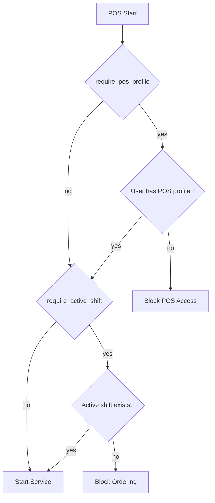
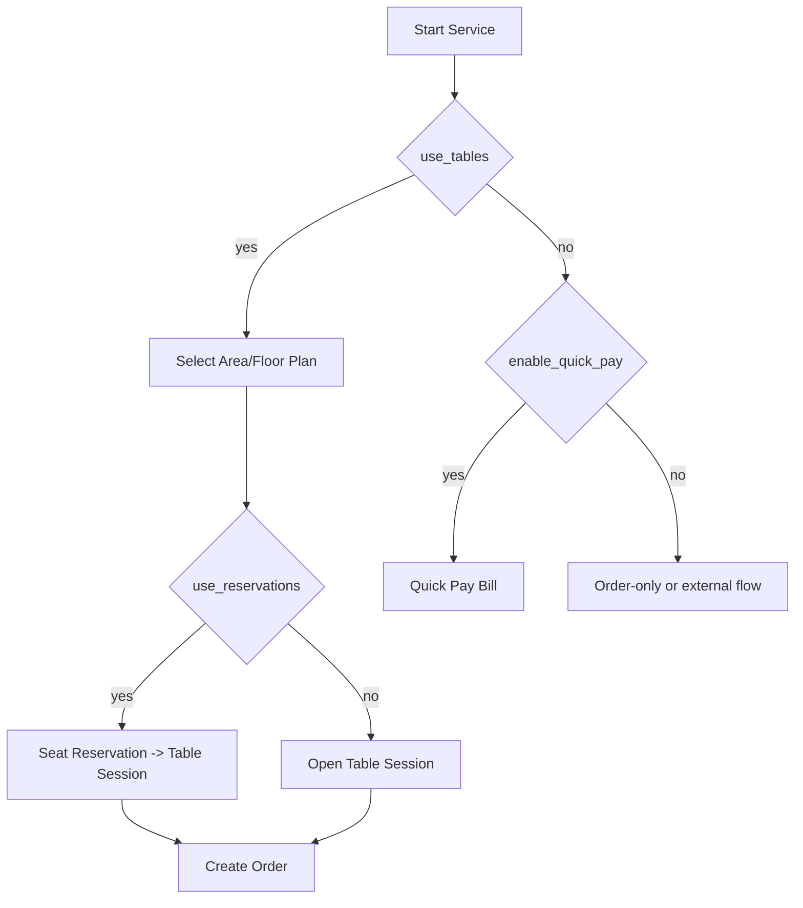
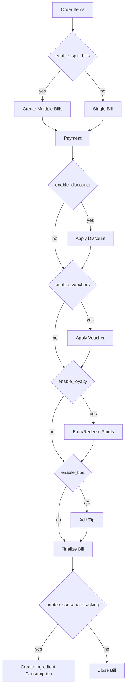
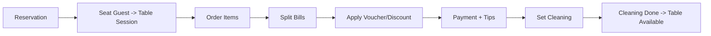
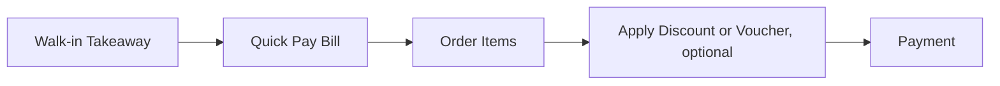
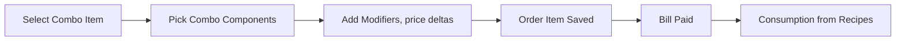
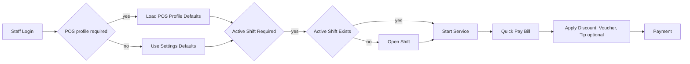
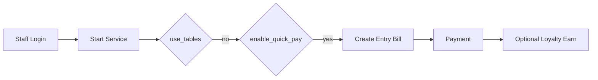
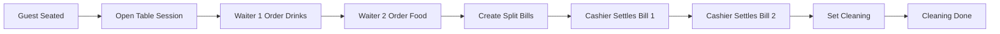
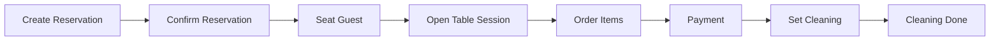

# ERPNext Restaurant - Feature Options and Workflows

This document explains how Restaurant Settings toggles affect the POS flow. It also includes example workflows.

## Feature Toggles (Effect Summary)
| Toggle | Effect | Typical Use |
| --- | --- | --- |
| use_tables | Enables table/session workflow | Restaurants with seating |
| use_floor_plans | Shows floor plans and table layout | Visual table management |
| use_reservations | Enables reservation flow | Booking management |
| require_table_session | Blocks billing without session | Strict table flow |
| enable_quick_pay | Allows bills without session | Bar/club quick pay |
| enable_split_bills | Multiple bills per session | Split checks |
| enable_discounts | Percent discounts on bills | Employee/loyalty discounts |
| enable_vouchers | Voucher sale and redemption | Gift cards |
| enable_loyalty | Loyalty card earn/redeem | Points programs |
| enable_tips | Tip capture on payment | Service tips |
| enable_container_tracking | Consumption tracking by container | Cocktails/ingredients |
| require_active_shift | Blocks orders if no shift | Cash control |
| require_pos_profile | Blocks POS access without profile | Per-user defaults |

## Access and Shift Gates

## Service Flow Selection

## Billing Add-ons (Discounts, Vouchers, Loyalty, Tips)

## Example Workflows

### Example 1: Dine-In with Reservation and Split Bills

### Example 2: Takeaway Quick Pay

### Example 3: Combo + Modifiers + Consumption

### Example 4: Bar Service with Staff Login and Shift

### Example 5: Disco Entry Payment, No Tables

### Example 6: Table Service with Multiple Staff and Split Bills

### Example 7: Reservation to Table, Then Cleaning

## Notes
- Combos use a single combo price; components are tracked for reporting and consumption.
- Modifier options are price deltas only.
- Consumption is recorded on payment to allow order cancellations before prep.
